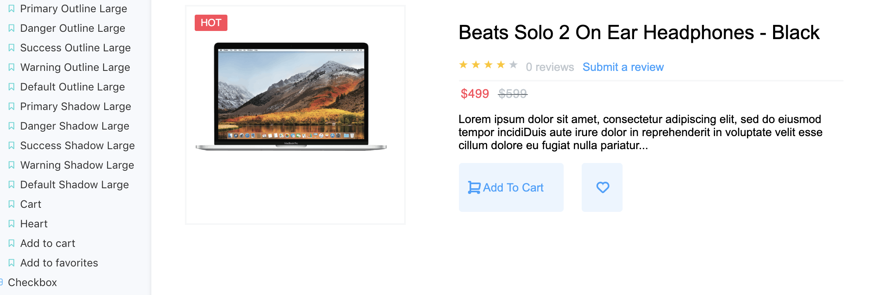

# Component Library

## Goal

The goal of this project was to create a component library that can be used to import a series of styled React components. Once imported, these components are ready to be used in a React app to save time creating components such as stylish buttons, user input fields, and product thumbnails.

## Languages & Programs Used

- React.js
- Storybook
- HTML/JSX
- CSS
- JavaScript

## Challenges

Styling all of the components was time consuming and required much attention to detail. It was also a challenge to write the logic so components could take in certain values as properties. For example, the counter component can take a minimum, maximum, and step value as a property. This allows the programmer importing this component to determine how high and low the counter can go and how much it will increase or decrease each time the user presses a button. Keeping the functionality of the components in mind as well as the style and design was an important piece of this project.

## Installation Instructions

To check out the styled components, visit the deployed site at https://admiring-minsky-ab4617.netlify.com/ !
To download the component library, go to https://www.npmjs.com/package/componentlibrary-toryklingenstein , copy the install command to the clipboard and run it in the terminal.
